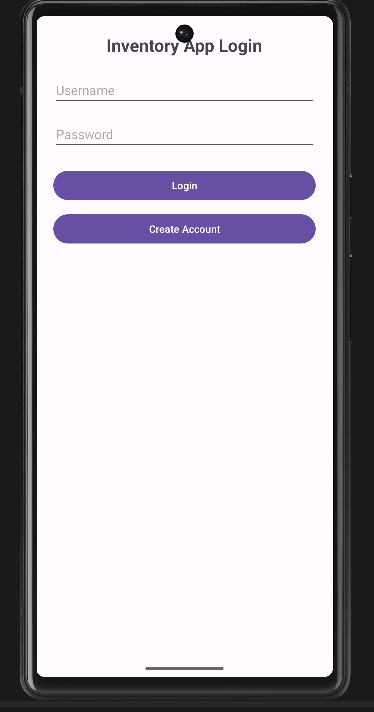
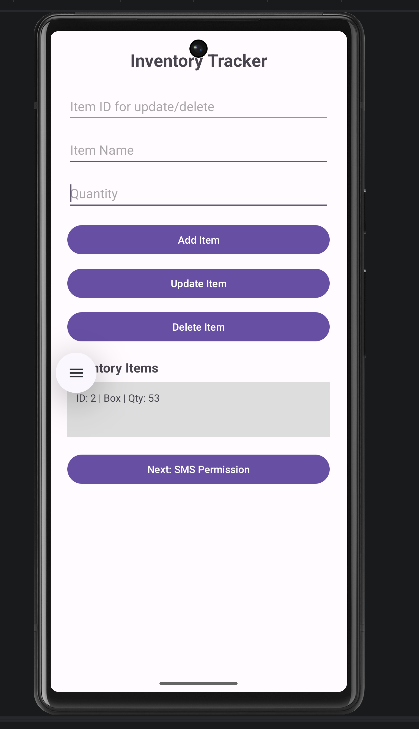
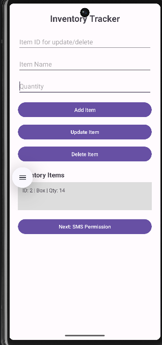
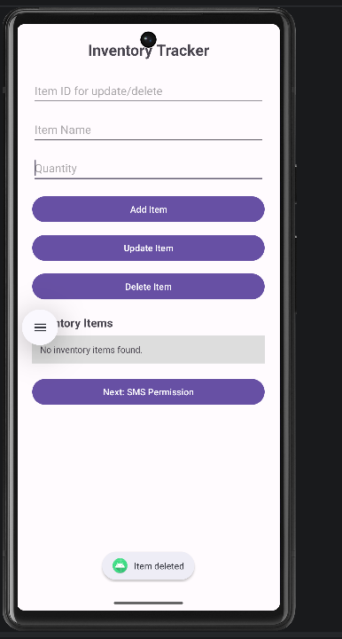
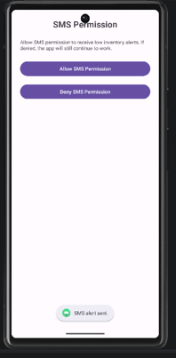
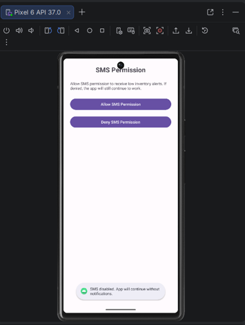

# Inventory App (Android)

## Overview

The Inventory App is a mobile application designed to help users keep track of items for personal use or small business management. The main goal of this app is to give users a simple and organized way to manage inventory without making it overly complicated.

Users are able to create an account, log in securely, add items, update quantities, delete items, and view all stored inventory in one place. The app also includes an optional SMS notification feature that alerts users when inventory is low. This helps users stay aware of their stock and avoid running out of important items.

---

## Features

- User authentication (login & account creation)
- Full CRUD functionality (Create, Read, Update, Delete)
- SQLite database for local storage
- Inventory tracking with item name and quantity
- SMS notification system for low inventory alerts
- Permission handling (user can allow or deny SMS access)

---

## User Needs & Goals

This app was designed for users who need a straightforward way to track inventory. This could include students, small business owners, or anyone managing supplies at home.

The main user needs addressed were:
- Keeping track of items in one place
- Easily adding, updating, and removing inventory
- Viewing item quantities clearly
- Receiving alerts when inventory is low

The goal was to make everything simple, fast, and easy to understand without requiring technical knowledge.

---

## Screens & Features

To support user needs, the app includes the following screens:

- **Login Screen**
  - Allows users to log in or create an account

- **Inventory Dashboard**
  - Add items  
  - Update item quantities  
  - Delete items  
  - View inventory list  

- **SMS Permission Screen**
  - Allows users to enable or deny SMS notifications  

The UI was designed to be clean and consistent across all screens. Buttons are clearly labeled, layouts are simple, and everything is easy to navigate.

---

## Development Approach

When coding the app, I focused on building each feature step by step instead of trying to do everything at once. I used Java and SQLite to handle data storage and made sure each function (add, update, delete) worked properly before moving on.

I also kept the code organized by separating responsibilities into different classes, such as using a `DatabaseHelper` for database operations. This made the app easier to manage and debug.

---

## Testing & Functionality

To test the app, I used the Android Emulator in Android Studio. I tested all major features including:

- Logging in and creating accounts  
- Adding items to the database  
- Updating item quantities  
- Deleting items  
- SMS permission handling (allow and deny)  

Testing is important because it helps catch errors early and ensures everything works as expected. I confirmed that the app continues to function even if SMS permission is denied, which improves user experience.

---

## Challenges & Problem Solving

One challenge I faced was handling SMS permissions properly. I had to make sure the app would still work even if the user denied permission. To solve this, I implemented logic that allows the app to continue running normally without notifications.

Another challenge was keeping the UI consistent across all screens. I solved this by using simple layouts and reusing styles for buttons and text.

---

## Key Strengths

The part of the app I was most successful with was the full CRUD functionality (Create, Read, Update, Delete). The app allows users to manage inventory smoothly, and all operations update correctly in the database.

I also focused on user-centered design by keeping the interface clean, simple, and easy to use.

---

## App Screenshots

### Login Screen

### Inventory Dashboard – Item Added

### Inventory Dashboard – Item Updated

### Inventory Dashboard – Item Deleted

### SMS Permission – Allow

### SMS Permission – Deny

---

## Tech Stack

- Java  
- Android Studio  
- SQLite Database  
- Android SDK  

---

## Conclusion

This project demonstrates my ability to design and develop a functional mobile application using Android Studio, Java, and SQLite. It highlights my understanding of user-centered design, problem solving, and building real-world applications.
